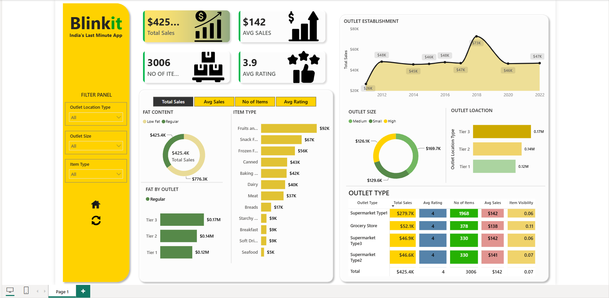
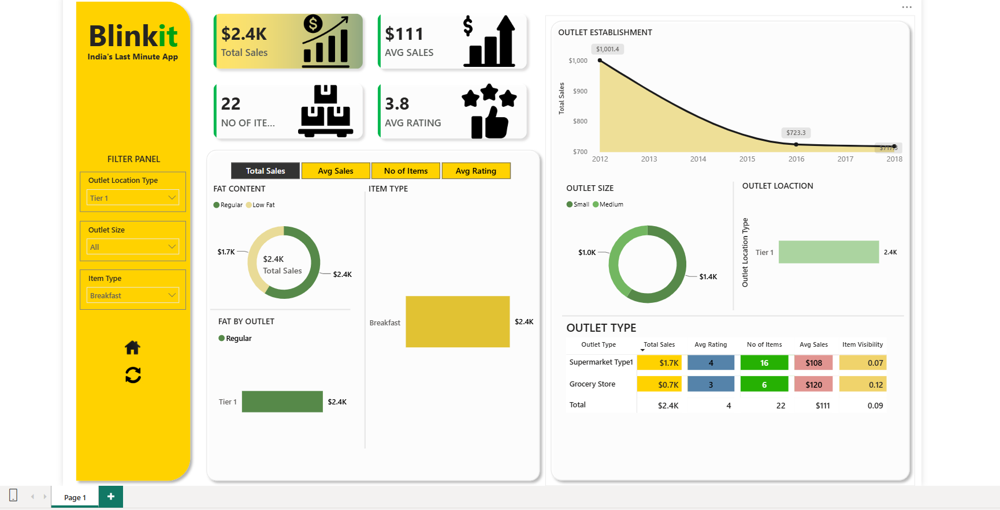

# 🛒 Blinkit Dashboard — Power BI Analytics Project


A single-page, interactive Power BI dashboard that analyzes sales, item, and outlet performance for **Blinkit** ("India's Last Minute App") using a grocery sales dataset. The report surfaces total sales, average sales/rating, item-type and fat-content breakdowns, and outlet performance (size, location tier, establishment year) behind a slicer-driven filter panel.

---

## Table of Contents

- [Summary](#summary)
- [Features and Scope](#features-and-scope)
- [Data Sources and Data Flow](#data-sources-and-data-flow)
- [Environment Requirements](#environment-requirements)
- [File Structure](#file-structure)
- [Setup Instructions](#setup-instructions)
- [How to Reproduce](#how-to-reproduce)
- [Usage Instructions](#usage-instructions)
- [Validation and Testing Notes](#validation-and-testing-notes)
- [Known Limitations](#known-limitations)
- [Future Enhancements](#future-enhancements)
- [Contributors and Governance](#contributors-and-governance)
- [License](#license)
- [Contact](#contact)

---

## Summary

Blinkit Dashboard is a one-page Power BI report built on top of the `BlinkIT Grocery Data` table (8,523 item-level sales records across 10 outlets). It gives category managers and outlet planners a fast read on:

- Overall sales performance (total sales, average sales, item count, average rating)
- Sales trends by outlet establishment year
- Breakdown of sales by fat content, item type, and outlet
- Outlet performance by size, location tier, and outlet type

At full (unfiltered) scope, the dataset totals **$425.4K** in sales across **3,006** unique items, with an average rating of **3.9**.


*Unfiltered dashboard: Total Sales, Avg Sales, No. of Items, and Avg Rating KPIs, Fat Content and Item Type breakdowns, Outlet Establishment trend, and Outlet Type table.*

## Features and Scope

- **KPI cards**: Total Sales, Average Sales, No. of Items, Average Rating
- **Toggle-able summary panel** (button bar): switch the left analysis panel between *Total Sales*, *Avg Sales*, *No of Items*, and *Avg Rating* views
- **Fat Content donut chart**: sales split between *Low Fat* and *Regular* items
- **Fat by Outlet bar chart**: fat-content sales broken out by outlet location tier (Tier 1 / Tier 2 / Tier 3)
- **Item Type bar chart**: sales ranked across all item categories (Fruits and Vegetables, Snack Foods, Frozen Foods, Dairy, Canned, Baking Goods, Meat, Breakfast, Breads, Starchy Foods, Soft Drinks, Seafood, etc.)
- **Outlet Establishment line chart**: total sales trended by the outlet's establishment year (2012–2022)
- **Outlet Size donut chart**: sales split by Small / Medium / High outlet size
- **Outlet Location clustered bar chart**: sales by location Tier 1 / Tier 2 / Tier 3
- **Outlet Type matrix/table**: Total Sales, Avg Rating, No. of Items, Avg Sales, and Item Visibility broken out by Outlet Type (Supermarket Type1/2/3, Grocery Store)
- **Filter panel (slicers)**: Outlet Location Type, Outlet Size, Item Type — all cross-filter every visual on the page
- Branded Blinkit theme (yellow/green palette, logo, and navigation icons)

## Data Sources and Data Flow

| Stage | Detail |
|---|---|
| **Source file** | `BlinkIT_Grocery_Data.xlsx` — single sheet, `BlinkIT Grocery Data` |
| **Grain** | One row per item sold at an outlet (8,523 rows × 12 columns) |
| **Columns** | `Item Identifier`, `Item Type`, `Item Fat Content`, `Item Weight`, `Item Visibility`, `Outlet Identifier`, `Outlet Establishment Year`, `Outlet Size`, `Outlet Location Type`, `Outlet Type`, `Sales`, `Rating` |
| **Ingestion** | Power Query (`Get Data → Excel Workbook`) loads the sheet into the Power BI data model with no external transformation steps beyond type formatting |
| **Modeling** | Single flat table loaded into the model (no relationships needed); DAX measures compute Total Sales, Avg Sales, No. of Items, and Avg Rating |
| **Presentation** | One report page (`Page 1`) consuming the model via native Power BI visuals |

Data flow in short: **Excel workbook → Power Query → Power BI data model → DAX measures → report visuals**.

## Environment Requirements

- **Power BI Desktop**: version *July 2024 or later* recommended (file was last saved with Power BI Desktop, schema version `1.28`)
- **Windows 10/11** (Power BI Desktop is Windows-only; use Power BI Service or a VM on macOS/Linux)
- **Power BI Service account** (Pro or Premium Per User license) — only required if you intend to publish/share the report online
- **Microsoft Excel** or Excel-compatible viewer to inspect the raw source data (optional)
- No custom visuals, R, or Python scripts are used — the report relies entirely on native Power BI visuals, so no extra runtime/engine installation is required

## File Structure

```
.
├── Blinkit.pbix                          # Main Power BI report (data model + report page)
├── BlinkIT_Grocery_Data.xlsx             # Source dataset (8,523 rows × 12 columns)
├── screenshots/
│   ├── dashboard-full-view.png           # Unfiltered dashboard (all outlets)
│   ├── dashboard-tier1-breakfast.png     # Filtered: Outlet Location Type = Tier 1, Item Type = Breakfast
│   └── dashboard-tier1-starchy-foods.png # Filtered: Outlet Location Type = Tier 1, Item Type = Starchy Foods
└── README.md                             # This file
```

> Rename the provided screenshots to the names above (or update this table) when adding them to the repo.

## Setup Instructions

1. **Install Power BI Desktop** (Windows) from the [Microsoft Store](https://aka.ms/pbidesktopstore) or the [direct download](https://www.microsoft.com/en-us/download/details.aspx?id=58494).
2. **Clone or download this repository**:
   ```bash
   git clone https://github.com/<your-org>/<your-repo>.git
   cd <your-repo>
   ```
3. **Open the dashboard**:
   - Double-click `Blinkit.pbix`, or open it from Power BI Desktop via `File → Open`.
4. **Verify data connection** (only needed if the source path changed):
   - `Home → Transform Data → Data Source Settings`, then re-point to your local copy of `BlinkIT_Grocery_Data.xlsx` if Power BI prompts for a missing file, and click **Refresh**.

No package managers, drivers, or external dependencies are required — everything needed to view and edit the report ships inside the `.pbix` file (data model + cached data), so the dashboard also opens and renders correctly even without re-connecting to the source Excel file.

## How to Reproduce

### Prerequisites
- Power BI Desktop installed (see [Setup Instructions](#setup-instructions))
- A Power BI Service account (Pro/PPU) — **only** if you plan to publish to the cloud

### Access the PBIX file and dataset
1. Download/clone this repo to a local folder.
2. Keep `Blinkit.pbix` and `BlinkIT_Grocery_Data.xlsx` in the same relative structure shown in [File Structure](#file-structure) — this avoids broken data-source paths.
3. Open `Blinkit.pbix` in Power BI Desktop. The report opens directly to `Page 1`.

### Refresh the data model (optional)
1. `Home → Refresh` to reload the latest data from `BlinkIT_Grocery_Data.xlsx`.
2. If you moved the Excel file, update the path via `Transform Data → Data Source Settings → Change Source`.

### Publish to Power BI Service
1. In Power BI Desktop, sign in via `Home → Sign in` with your Power BI Service account.
2. Click `Home → Publish`.
3. Choose a destination workspace (e.g., `My Workspace` or a shared team workspace).
4. Once published, open [app.powerbi.com](https://app.powerbi.com) to view, share, or schedule a data refresh for the report.
5. (Optional) Configure a **scheduled refresh** under the dataset's settings if the source Excel file is stored in OneDrive/SharePoint, so the online report stays current without manual re-publishing.

## Usage Instructions

- **Filter Panel** (left sidebar) — three dropdown slicers:
  - **Outlet Location Type**: All / Tier 1 / Tier 2 / Tier 3
  - **Outlet Size**: All / Small / Medium / High
  - **Item Type**: All or a specific category (e.g., Breakfast, Starchy Foods, Dairy)
- **Summary panel toggle buttons** (`Total Sales`, `Avg Sales`, `No of Items`, `Avg Rating`) switch the metric displayed in the Fat Content and Fat-by-Outlet visuals.
- **Cross-filtering**: clicking any donut/bar segment (e.g., a fat-content slice or an item-type bar) cross-filters the rest of the page.
- **Reset icon**: the circular arrow icon under the filter panel clears all active slicer selections back to `All`.
- **Home icon**: returns to the report's default landing view.
- **Outlet Type table**: sortable by any column (Total Sales, Avg Rating, No. of Items, Avg Sales, Item Visibility) by clicking the column header.

### Example filtered views
| Filter applied | Total Sales | Avg Sales | No. of Items | Avg Rating |
|---|---|---|---|---|
| None (all data) | $425.4K | $142 | 3,006 | 3.9 |
| Outlet Location Type = Tier 1 | $2.4K | $111 | 22 | 3.8 |
| Outlet Location Type = Tier 1, Item Type = Breakfast | $2.4K | $111 | 22 | 3.8 |
| Outlet Location Type = Tier 1, Item Type = Starchy Foods | $2.9K | $152 | 19 | 3.8 |


*Filtered view: Outlet Location Type = Tier 1, Item Type = Breakfast. All visuals — KPI cards, Fat Content, Outlet Establishment trend, Outlet Size/Location, and the Outlet Type table — update together in response to the slicers.*

## Validation and Testing Notes

- **Row count check**: confirmed the source sheet loads 8,523 data rows (plus header) with 12 columns matching the expected schema (`Item Identifier`, `Item Type`, `Item Fat Content`, `Item Weight`, `Item Visibility`, `Outlet Identifier`, `Outlet Establishment Year`, `Outlet Size`, `Outlet Location Type`, `Outlet Type`, `Sales`, `Rating`).
- **KPI cross-check**: unfiltered card totals ($425.4K Total Sales, $142 Avg Sales, 3,006 No. of Items, 3.9 Avg Rating) reconcile with the "Total" row of the Outlet Type table.
- **Slicer regression test**: applying and clearing each slicer (Outlet Location Type, Outlet Size, Item Type) independently and in combination was verified to update all visuals consistently, with no orphaned/stale visual state.
- **No custom visuals or external scripts** are used, so there are no third-party visual compatibility risks when opening the file in a standard Power BI Desktop install.
- Recommended before each release: manually spot-check 2–3 slicer combinations against the Outlet Type table totals, and confirm the data source refreshes without errors from a clean `BlinkIT_Grocery_Data.xlsx` copy.

## Known Limitations

- Single flat table with no separate date, item, or outlet dimension tables — limits more advanced time-intelligence DAX (e.g., YoY, rolling averages) without remodeling.
- `Outlet Establishment Year` is a discrete year value, not a true date column, so the trend line is year-granular only.
- No row-level security (RLS) is configured; anyone with report access sees all outlets and item types.
- Report is a single page; there is no drill-through page for a single outlet or single item.
- Currency is displayed in `$`, though the underlying business context ("India's Last Minute App") suggests figures may originate in INR — confirm currency/unit assumptions before using figures externally.

## Future Enhancements

- Split the flat table into a proper star schema (`Fact_Sales`, `Dim_Item`, `Dim_Outlet`, `Dim_Date`) for cleaner DAX and better performance at scale.
- Add a drill-through page for outlet-level and item-level deep dives.
- Add YoY/MoM trend measures once a true date table is introduced.
- Implement row-level security by outlet region for multi-tenant/franchise use cases.
- Add a mobile-optimized report layout (Power BI mobile layout view).
- Automate scheduled refresh from a live source (e.g., SharePoint/OneDrive or a database) instead of a static Excel file.

## Contributors and Governance

| Role | Responsibility |
|---|---|
| Dashboard Owner | Report design, DAX measures, and data modeling |
| Data Owner | Maintains and validates `BlinkIT_Grocery_Data.xlsx` source accuracy |
| Reviewers | Validate KPI accuracy and slicer behavior before each release |

Contributions are welcome — please open an issue describing the change (new visual, measure, or data fix) before submitting a pull request, and include before/after screenshots for any visual changes.

## License

This project is licensed under the [MIT License](LICENSE). The Blinkit name and logo are used here for portfolio/demo purposes only and are not affiliated with or endorsed by Blinkit/Blink Commerce Pvt. Ltd.

## Contact

- **Maintainer**: _add your name/handle here_
- **Issues**: please use this repository's GitHub Issues tab for bugs, data questions, or feature requests
- **Email**: _add contact email here_

---

*Screenshots referenced in this README are included in the `screenshots/` folder and reflect the unfiltered dashboard view plus two example filtered states (Tier 1 / Breakfast and Tier 1 / Starchy Foods).*
